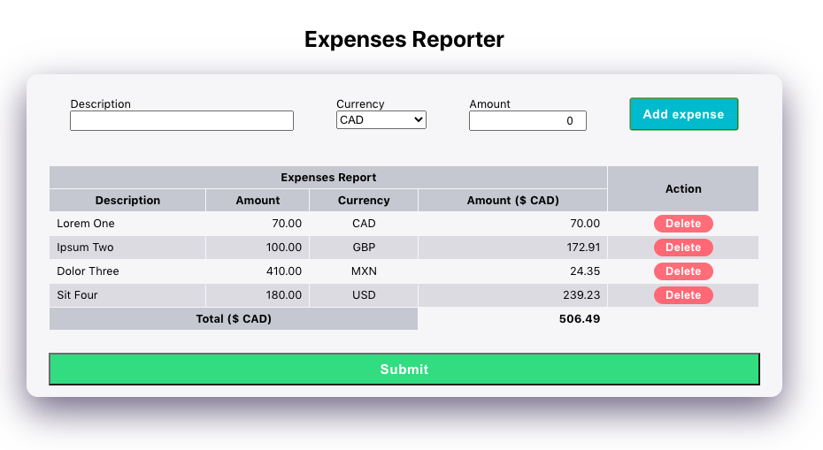

This project was bootstrapped with [Create React App](https://github.com/facebook/create-react-app).

## Scripts

In the project directory, you can run:

### `npm start`

Open [http://localhost:3000](http://localhost:3000) to view it in the browser.

## PayTM 60-90 min Front End Web Coding Challenge

Create a web app to enter receipts into an expense report.

## Requirements:

1. The expense report can have **up to 5 receipts**.

2. Each receipt should have a **description**, **amount** and **currency**.
  - Any receipt can be entered in any of the supported currencies.

3. Each receipt should show its **amount in CAD $**
  - Get exchange rates from https://api.exchangeratesapi.io/latest?base=CAD

4. There should be a **total for the entire expense report, in CAD $**, which should be displayed at the bottom of all receipts.

5. It should **prevent you from submitting a report totalling over $1,000 CAD**
   - If the total amount of all receipts exceeds $1,000 CAD it should disable the submit button and display a message stating that the expense report limit has been exceeded.

6. There should be a button to **submit the expense report**, which will log the receipt data to the browser's dev tool console.

## Solution

I failed to deliver the solution in the expected 90 minutes time. 

I am just following the advice of the recruiter guy and complete it and send it anyway !!

So I took where I left and worked to complete it. Although there's still space to improvements, this is at least a working version.
 
It's coded in React (from a CreateReactApp initial scaffold) using functional components. 

The `ExpensesReport`  component represents the main entity/view of the problem domain

It's defined and exported in the `ExpensesReport.js` file. 

I defined other inner related components `ExpenseView` and `ExpensesTableView` that lives on same file. 

The styling is using plain CSS for now. No need to use CSSModules or CSSinJS or other nicer fancier stuff.   

Here is a screenshot of running solution in my local env

